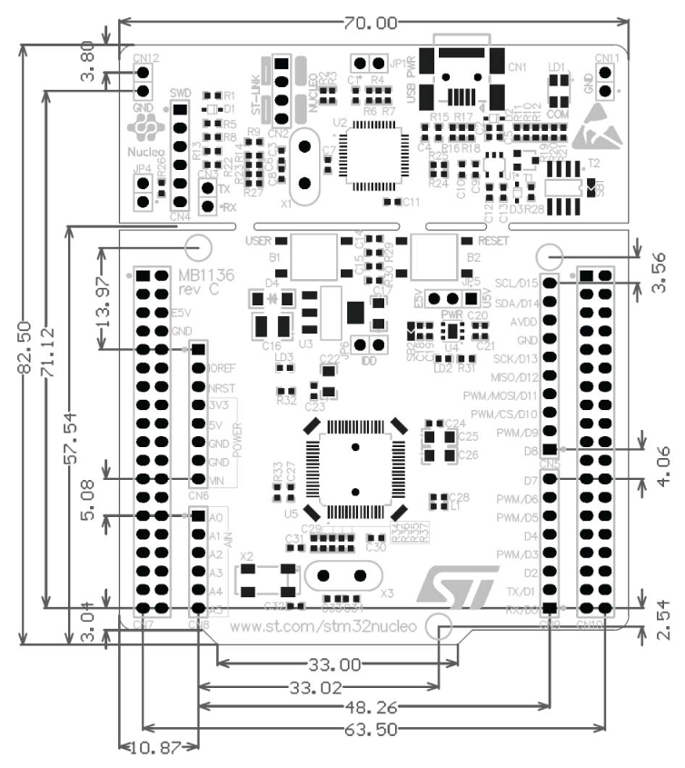

# Smart Watch (Ver 2)

KiCAD Project is located in `./KiCad`.  
Universal Design Sources (Such as Module Layout) can be found at `./Design Sources`.

## Libraries Added

 - Nucleo L476RG Baseboard (for HAT Design)

## Ref Files

### L476RG

Mechanical Size: [ref/canvas.png](ref/canvas.png)

Data Sheet: [ref/um1724-stm32-nucleo64-boards-mb1136-stmicroelectronics.pdf](ref/um1724-stm32-nucleo64-boards-mb1136-stmicroelectronics.pdf)

### GD5F1GQ4xBxIG (SPI NAND Flash)

Data Sheet: [ref/GD5F1GQ4xBxIG.pdf](ref/GD5F1GQ4xBxIG.pdf)

